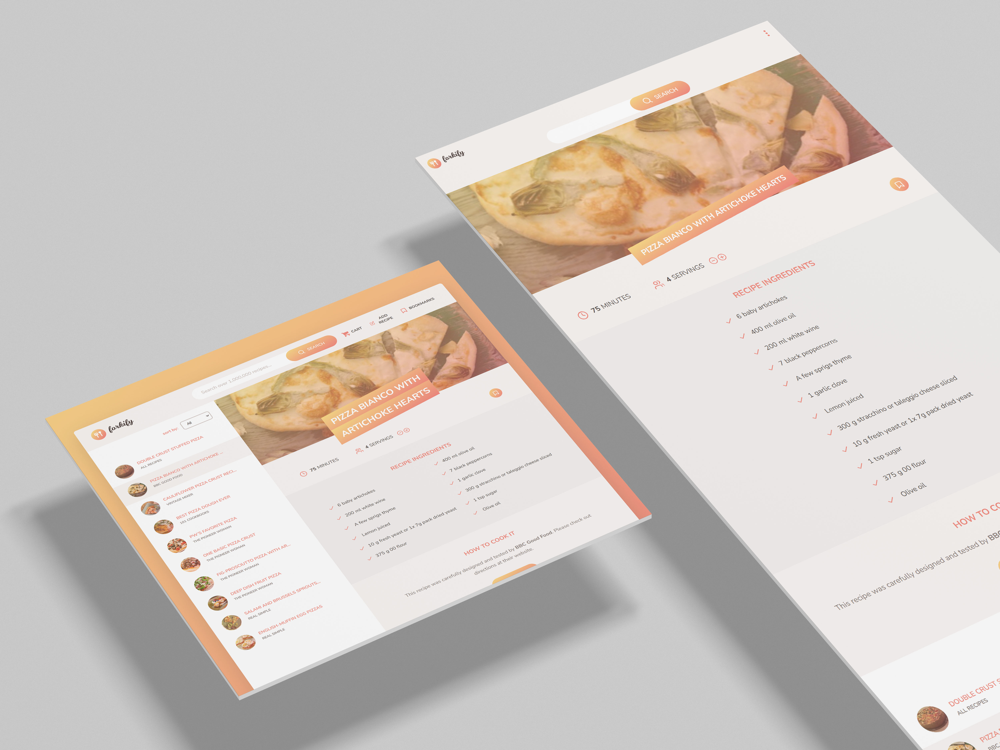

# Forkify: Recipe Management Website

> ### Description:

Forkify is a dynamic recipe management application for finding different recipes and create recipes, showcasing advanced features and implementing the Model-View-Controller **(MVC)** architecture for clean and maintainable code.

> ### Key Features:

1. Search Functionality:

   - Input field allows users to search for recipes by keywords.
   - Displays search results with pagination for improved navigation.

2. Recipe Details:

   - Displays detailed recipe information, including cooking time, servings, and a list of ingredients.

3. Bookmarks:

   - Users can bookmark recipes they like.
   - Bookmarked recipes are stored locally using local storage and are displayed on page load.

4. Serving Adjustment:

   - Users can adjust the number of servings, dynamically updating ingredient quantities accordingly.

5. User Recipe Management:

   - Users can upload their own recipes.
   - Uploaded recipes are automatically bookmarked.
   - Only the uploading user can view their own recipes, ensuring privacy.

6. Shopping List:

   - Generates a shopping list containing all the ingredients for a selected recipe.

> ### Technical Architecture:

1. MVC Design Pattern:

   Ensures a modular code structure separating data (Model), user interface (View), and application logic (Controller).

2. Local Storage Integration:

   Bookmark data and user recipes persist across sessions.

> ### Tech stack:

`HTML` - `SASS` - `JavaScript`

---

> ### Goals:

This project demonstrates a strong understanding of JavaScript, API integration, and modern architectural patterns, making it a well-rounded and user-friendly web application.
